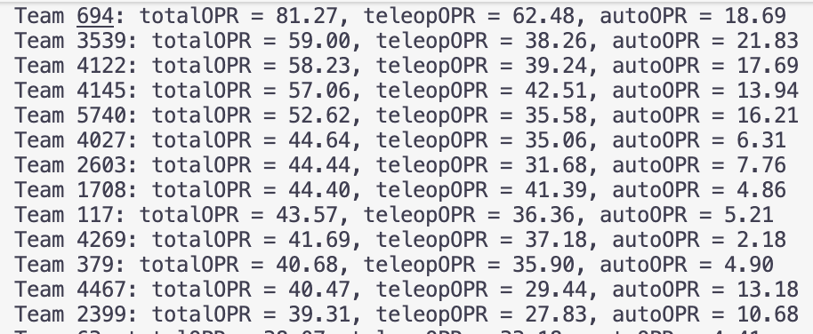

# FRC/FTC Robot OPR Computation

Temporary Note: The Orange Alliance is down at this moment, so don't call FTC. 

This is a python project that works uses numpy to provide a list of robot's OPR for a given event from either FRC or FTC. The data comes from The Blue Alliance for FRC events and The Orange Alliance for FTC events. 

## How to use?

- Gain API Key and Event Key from the website. [How to Get API Key](#how-to-get-api-key)
- Run main.py for no-gui and main.py for gui version
- Specify which game you are checking. 
- Input the Event Key and API Key. 

## How to get API Key

### For FRC

Go to [Account Setting of TBA](https://www.thebluealliance.com/account/login?next=http://www.thebluealliance.com/account) and apply for a Read API Key. For more information, see [Get API Key for The Blue Alliance](https://www.thebluealliance.com/apidocs) 

### For FTC

Note that The Orange Alliance is down at this moment, this part will be updated as long as the website comes back. 

## Example Output

